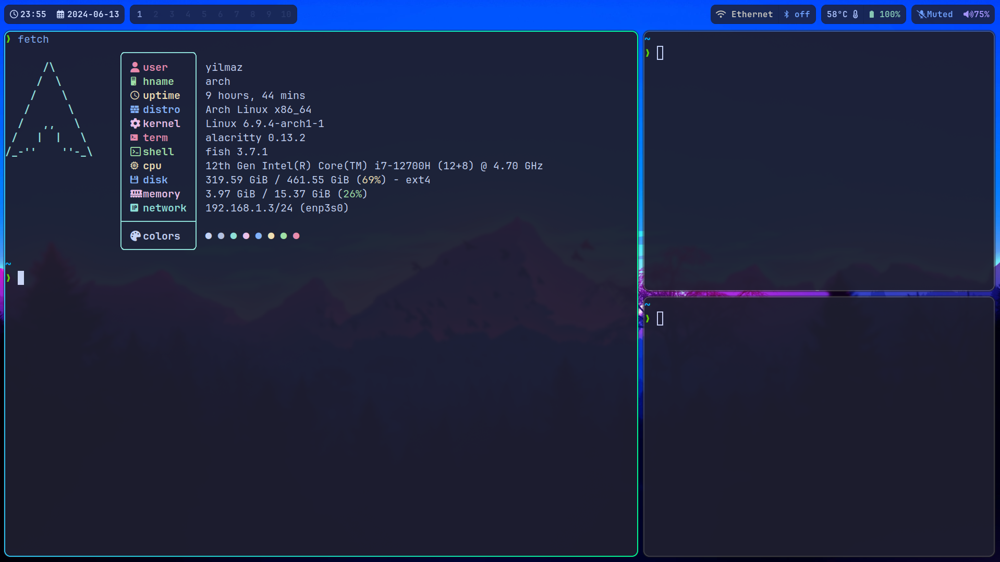

# My Arch Linux Configuration and Dotfiles
This repository contains my personal configuration files for Arch Linux.
## Screenshots

## Hyprland
I personally like using a wayland compositor, so I use [Hyprland](https://hyprland.org/) as my compositor. It also has amazing animations.
## Configuration File Locations
```
~/.config/waybar/ directory -> ./waybar/
~/.config/swaylock/ directory -> ./swaylock/
~/.config/mako/ directory -> ./mako/
~/.config/fish/ directory -> ./fish/
~/.config/alacritty/ directory -> ./alacritty/
~/.config/wofi/ directory -> ./wofi/
~/.config/hypr/ directory -> ./hypr/
~/.config/user-dirs.dirs -> ./user-dirs.dirs
```
## Installed Packages
The result of:
```
yay -Q >> installed_packages
```
is in the file ./installed_packages